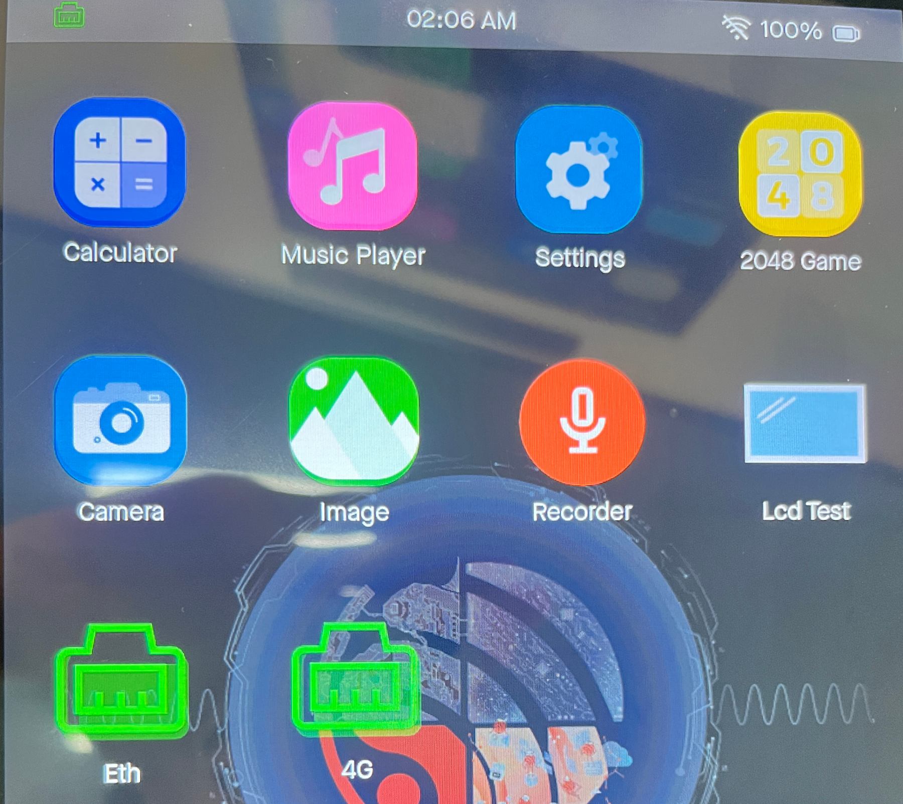
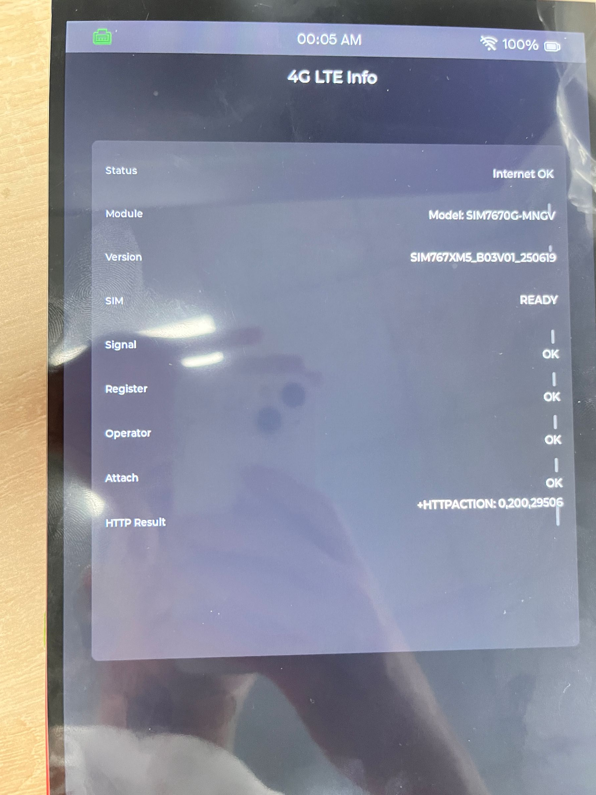

# MaTouch ESP32-P4 TFT with 4G LTE Touch 10.1“ MIPI

## Introduction

The MaTouch ESP32-P4 TFTTouch 10.1" MIPI with 4G LTE SIM7670G is an upgraded high-resolution, all-in-one HMI solution designed for smart control systems, industrial dashboards, remote IoT terminals, and AI-enabled applications. This module integrates a powerful ESP32-P4 processor, built-in SIM7670G 4G LTE Cat.1 module, a crystal-clear 10.1" IPS display, full multimedia support, and robust multi-mode wired/wireless connectivity, all inside a refined, ready-to-use enclosure.

Powered by the RISC-V dual-core ESP32-P4 (400MHz) with 16MB Flash and 32MB PSRAM, the system handles complex UIs, LVGL rendering, and real-time multimedia tasks with ease. The independent ESP32-C6 wireless module adds Wi-Fi 6 and Bluetooth LE support for reliable, modern IoT connectivity, while the onboard 4G LTE module enables stable data transmission without local Wi-Fi or Ethernet coverage.

One of the standout features is the stunning 10.1-inch 1280×800 IPS MIPI display, offering sharp visuals, vibrant colors, and smooth touch interaction—ideal for both consumer-facing interfaces and professional industrial panels.Integrated 2MP MIPI camera (SC2336) delivers high-definition image capture, suitable for facial recognition, monitoring, visual interaction, and embedded AI vision tasks. With onboard microphone input, the device is also well-prepared for far-field voice control or audio-enabled applications. For stable and high-speed communication, the device features built-in Ethernet (IP101GRI)—making it suitable for industrial environments where wireless alone is not reliable.A refined protective enclosure allows developers to deploy the device quickly without additional mechanical design. Each unit also comes with a MicroSD card pre-included, enabling logs, multimedia storage, and rapid local data processing right out of the box.

Product Link: [MaTouch ESP32-P4 TFT with 4G LTE Touch 10.1“ MIPI](https://www.makerfabs.com/matouch-esp32-p4-tfttouch-10-1-mipi-with-4g-lte-sim7670g.html)

Wiki Link:  [MaTouch ESP32-P4 TFT with 4G LTE Touch 10.1“ MIPI](https://wiki.makerfabs.com/MaTouch%20ESP32_P4%20TFT%20with%204G%20LTE%20Touch%2010.1%E2%80%9C%20MIPI.html)

Example：1.[4G_LTE_HTTP_Test](https://github.com/Makerfabs/MaTouch_ESP32-P4_TFT_with_4G_LTE_Touch_10_1_MIPI#4g_lte_http_test)
         

## Features

- Controller: ESP32-P4NRW32X
- Flash: 16MB Flash
- PSRAM: 32MB
- Wireless: 2.4GHz Wi-Fi 6 (802.11ax)，Bluetooth® 5 (LE)(ESP32-C6FH4)
- LCD: 10.1", 1280x800 resolution
- LCD Driver: JD9365
- LCD interface: MIPI
- Touch Panel: 5 Points Touch, Capacitive
- Touch Panel Driver: GT911
- USB: 1 * USB to UART, 1 * USB_NATIVE, 1 * USB_CDC/JTAG, 1 * USB_OTG, 1 * USB_DEVICE,
- Power Supply: USB Type-C 5.0V(4.0V~5.25V)
- Button: Flash button and reset button
- Camera Maximum Resolution: 2 Million Pixels, 1920H×1080V
- Camera Driver: SC2336
- Camera interface: MIPI
- Ethernet: IP101GRI
- 4G LTE: SIM7670G
- 4G Category: TDD/FDD-LTE CAT.1
- Data rate: 10 Mbps (DL),5 Mbps (UL)
- LTE-FDD Bands: B1/B2/B3/B4/B5/B7/B8/B12/B13/B18 /B19/B20/B25/B26/B28/B66/B71
- LTE-TDD Bands: B34/B38/B39/B40/B41
- Microphone input: Yes
- Audio output: ES8311
- MicroSD: Yes
- Charger: Yes
- Battery Connector: Yes
- Expansion interface: 26 * GPIO
- Arduino support: Yes
- LVGL support: Yes

## Example

### 4G_LTE_HTTP_Test

For details of this example, please refer to the [Wiki](https://wiki.makerfabs.com/MaTouch%20ESP32_P4%20TFT%20with%204G%20LTE%20Touch%2010.1%E2%80%9C%20MIPI.html#54g_lte_http) document.